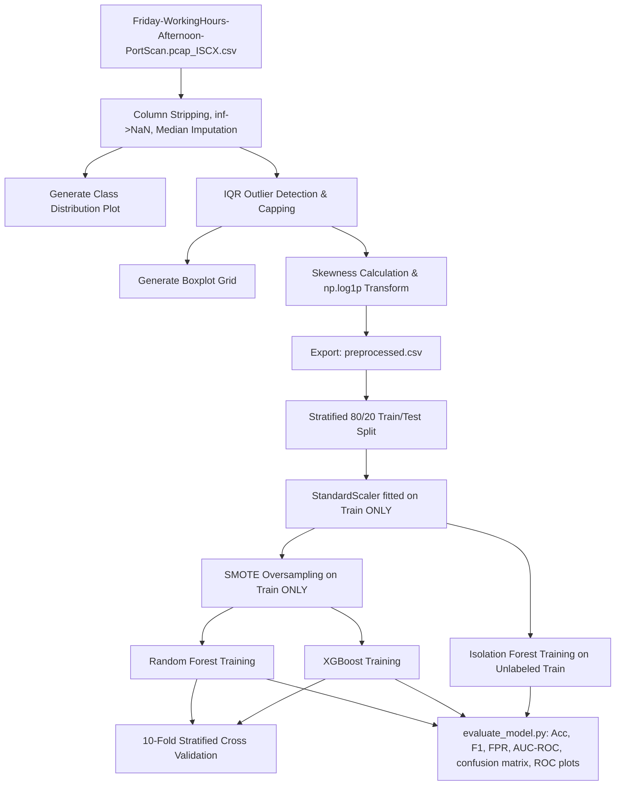
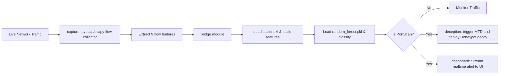

# AEGIS Entropy - Comprehensive Project Context, Architectural Blueprint & Historical Documentation

This document serves as the absolute "source of truth" and complete historical record for the **AEGIS Entropy** project. It is designed to provide any autonomous agent, engineer, or collaborator with a line-by-line, module-by-module, and mathematical understanding of what has been built, why it was built that way, and how the entire system integrates.

---

## 1. Executive Summary & Core Requirements

**AEGIS Entropy** is an intelligent, active-defense Intrusion Detection System (IDS) designed specifically to detect, analyze, and mitigate **Port Scan** attacks in network environments.

### 1.1 The Threat: Port Scanning
Port scanning is the primary reconnaissance phase of almost all cyberattacks. Attackers probe host ports to identify active services, operating system versions, and potential vulnerabilities. Traditional signature-based IDS struggle with:
- Rapidly mutating scan patterns.
- "Low and slow" stealthy scans that spread requests over hours or days to evade threshold alerts.
- High rates of false alarms on complex network environments.

### 1.2 The AEGIS Entropy Approach
AEGIS combines three defense paradigms:
1.  **Passive Machine Learning Detection:** Supervised classifiers (Random Forest, XGBoost) trained on highly optimized network flow features to recognize scan signatures instantly.
2.  **Unsupervised Anomaly Detection:** An Isolation Forest module dedicated to spotting abnormal behavior (like slow, stealthy scans) that doesn't match baseline benign traffic.
3.  **Active Deception & De-synchronization (MTD + Honeypot):** A dynamic host defense that shifts port locations (Moving Target Defense) and redirects scanners to decoy services (Honeypot) to waste attacker resources and collect threat intelligence.

### 1.3 Key Performance Indicators (KPIs) / Success Criteria
The system's machine learning engine must meet or exceed the following performance metrics under rigorous validation:
*   **F1-Score:** $\geq$ 88% (harmonic mean of Precision and Recall, ensuring both low false positives and high detection rates).
*   **Accuracy:** $\geq$ 90% (overall classification accuracy).
*   **False Positive Rate (FPR):** $<$ 6% (critical for preventing operator alert fatigue).

---

## 2. Project Architecture & Repo Blueprint

The project is structured inside a central git repository: `adillekhbioui-collab/Portscan_IDS`. The workspace layout is defined as follows:

```
Portscan_IDS/
├── .gitignore                   # Excludes massive data files (>50MB) and build artifacts
├── README.md                    # Core repository description
├── config.py                    # Global configuration stubs
├── requirements.txt             # Global python dependencies
│
├── detection/                   # ML PIPELINE MODULE (Refactored & Completed)
│   ├── CHANGES.md               # Detailed changelog of ML pipeline modifications
│   ├── requirements.txt         # Module dependencies (including imbalanced-learn)
│   ├── models/                  # Saved serializations (.pkl)
│   │   ├── scaler.pkl           # Saved StandardScaler configuration
│   │   ├── random_forest.pkl    # Trained Random Forest classifier
│   │   ├── xgboost.pkl          # Trained XGBoost classifier
│   │   └── isolation_forest.pkl # Trained Isolation Forest anomaly detector
│   ├── data/                    # Data directory (preprocessed.csv stored locally, ignored by git)
│   ├── results/                 # Evaluation plots and metrics
│   │   ├── class_distribution.png
│   │   ├── correlation_heatmap.png
│   │   ├── boxplot_*.png        # Winsorization boxplots for 9 features
│   │   ├── confusion_matrix_*.png
│   │   ├── roc_*.png
│   │   └── metrics.csv          # Numeric evaluations of models
│   ├── src/                     # ML Engine Source Code
│   │   ├── data_preprocessing.py# Loading, cleaning, winsorizing, log-transforming
│   │   ├── feature_selection.py # Mapping, placeholder creation, and correlation analysis
│   │   ├── modeltrain.py        # Scaling, SMOTE, Stratified 10-Fold CV, model fitting
│   │   ├── evaluate_model.py    # Metric extraction, ROC generation, Success validation
│   │   └── predict.py           # Scaling wrapper for production/real-time inference
│   └── report/                  # Academic LaTeX documentation
│       ├── figs/                # Embedded figures copied from results/
│       ├── ml_pipeline_report.tex     # LaTeX Part 1 (Intro, Preprocessing, Scaling)
│       └── ml_pipeline_report_part2.tex # LaTeX Part 2 (Training, CV, Results, Failure Analysis)
│
├── capture/                     # REAL-TIME TRAFFIC SNIFFING (Pending Integration)
│   └── README.md                # Stubs for real-time packet-to-flow feature extraction
│
├── deception/                   # ACTIVE DEFENSE ENGINE (Pending Integration)
│   ├── honeypot/                # Decoy port services logging scanner interactions
│   └── mtd/                     # Moving Target Defense dynamic port shuffling
│
├── dashboard/                   # FRONTEND COMMAND CENTER (Pending Design/Implementation)
│   └── ...                      # High-fidelity Cyber-Security themed UI using D3/Tailwind
│
└── bridge/                      # INTEGRATION MODULE (Pending Implementation)
    └── ...                      # Bridges capture -> detection -> deception -> dashboard
```

---

## 3. The Feature Selection & Data Dictionary

A core requirement of the ML pipeline is alignment with the project's official **Data Dictionary**. Out of 13 defined security metrics, the dataset (`CICIDS2017` flow-level CSV) does not contain raw packet-level or host-level variables. To resolve this, a robust mapping and placeholder scheme was designed:

### 3.1 Feature Mapping Table

| Theoretical Feature (Dict.) | Available? | CSV Column Map | Type | Description / Proxy Logic |
|---|---|---|---|---|
| **Distinct Destination Ports** | Proxy | `Destination Port` | Integer | Scanners target a high variance of destination ports. The port number itself acts as a proxy indicator. |
| **SYN Flag Count** | Yes | `SYN Flag Count` | Binary | Count of SYN packets in the flow. Vital for TCP SYN Scan detection. |
| **RST Flag Count** | Yes | `RST Flag Count` | Binary | Count of RST packets. Indicates connection resets, common in TCP Connect scans. |
| **Flow Duration** | Yes | `Flow Duration` | Float | Scans typically have very short durations (aggressive) or very long durations (stealthy). |
| **Total Forward Packets** | Yes | `Total Fwd Packets` | Integer | Total packets sent in the forward direction. |
| **ACK Flag Count** | Yes | `ACK Flag Count` | Binary | ACK packets indicate completed handshakes or out-of-sequence scan checks. |
| **IAT Mean** | Yes | `Flow IAT Mean` | Float | Mean Inter-Arrival Time between packets. Highly discriminative for scanning speed. |
| **Bwd Packet Length** | Proxy | `Bwd Packet Length Mean`| Float | Mean size of packets in the backward (reply) direction. |
| **TCP Window Size** | Proxy | `Init_Win_bytes_forward`| Integer | Initial bytes sent in the TCP window in the forward direction. |
| **Unique Dst IPs** | No | *N/A* | - | Absent from flow CSV. Exclusively extracted by the live capture module. |
| **TTL Value** | No | *N/A* | - | Time-To-Live values are stripped at the flow-aggregation layer. |
| **Shadow Node Interaction** | Placeholder | `shadow_node_interaction`| Binary | Set to 0 in training. Represents live honeypot interaction (1 if scanner hit a honeypot). |
| **MTD Port Delta** | Placeholder | `mtd_port_delta` | Integer | Set to 0 in training. Represents the offset of the targeted port from active MTD port. |

---

## 4. Deep-Dive: The Machine Learning Pipeline

The machine learning pipeline inside `detection/` was completely rewritten to correct issues of data leakage, lack of outlier management, uncorrected skewness, and improper anomaly contamination thresholds.



### 4.1 Data Cleaning & Preprocessing (`data_preprocessing.py`)

#### Step 1: Whitespace Removal
The raw CICIDS2017 CSV headers contain leading and trailing spaces (e.g., `" Destination Port"` instead of `"Destination Port"`).
```python
df.columns = [col.strip() for col in df.columns]
```

#### Step 2: Infinity and Missing Value Resolution
Mathematical divisions over zero duration produce `inf` or `-inf` values in rates. These are replaced with `NaN`, and then filled using **median imputation** (robust to skewed data):
$$\text{df}[F] = \text{df}[F].\text{fillna}(\text{median}(F))$$

#### Step 3: Outlier Capping (Winsorization)
Rather than deleting rows containing outliers (which would delete valid malicious flow signatures), the pipeline detects outliers using the **Interquartile Range (IQR)** and caps them at the statistical boundaries.
*   **Interquartile Range:** $IQR = Q_3 - Q_1$ (where $Q_1$ and $Q_3$ are the 25th and 75th percentiles).
*   **Lower Bound:** $LB = Q_1 - 1.5 \times IQR$
*   **Upper Bound:** $UB = Q_3 + 1.5 \times IQR$
*   **Capping Rule:** 
    $$x_i = \begin{cases} 
      LB & \text{if } x_i < LB \\
      UB & \text{if } x_i > UB \\
      x_i & \text{otherwise}
   \end{cases}$$

#### Step 4: Skewness Correction
The Fisher Skewness Coefficient is computed for all numeric columns:
$$\gamma_1 = E\left[\left(\frac{X - \mu}{\sigma}\right)^3\right]$$
Any feature with an absolute skewness $|\gamma_1| > 1.0$ undergoes a logarithmic transformation to normalize its scale and stabilize variance:
$$x'_i = \log(1 + x_i)$$
The shift to using $\log(1+x)$ (via `np.log1p`) handles zero-valued parameters (like flag counts) safely.

---

### 4.2 Split, Normalization, & Balancing (`modeltrain.py`)

#### Step 1: Stratified Split (80/20)
Data is split into 80% training and 20% testing using stratified sampling to maintain the class distribution:
*   **Total Samples:** 286,467
*   **Training Set Size ($N_{train}$):** 229,173 (PortScan: 127,144; BENIGN: 102,029)
*   **Test Set Size ($N_{test}$):** 57,294 (PortScan: 31,786; BENIGN: 25,508)

#### Step 2: Scale Standardisation (Data Leakage Avoidance)
To ensure distance-based models evaluate features on the same scale, we standardize data to mean = 0, standard deviation = 1:
$$z = \frac{x - \mu_{train}}{\sigma_{train}}$$
**Critical Rule:** The `StandardScaler` is fitted *only* on the training set $X_{train}$. The test set $X_{test}$ is transformed using the training parameters ($\mu_{train}, \sigma_{train}$). Scaling before split leaks future information into training, creating false test metrics.

#### Step 3: Synthetic Minority Over-sampling Technique (SMOTE)
SMOTE is applied **only** to the scaled training dataset to balance the class proportions (making it a 50/50 split of 254,288 samples).
*   **Algorithm:** For each sample in the minority class (BENIGN), its $k$-nearest neighbors are calculated ($k=5$). A neighbor is chosen randomly, and a synthetic sample is generated along the line segment joining the two points:
    $$x_{new} = x_i + \lambda(x_{neighbor} - x_i) \quad \text{where } \lambda \sim U(0,1)$$
*   Applying SMOTE to the test set or before scaling is strictly avoided as it introduces massive data leakage.

#### Step 4: Stratified 10-Fold Cross-Validation
Before final training, Stratified 10-Fold CV is run on the training set to verify statistical stability. The training set is split into 10 folds; in each iteration, 9 folds train the model and 1 fold validates it.
*   **Random Forest CV F1-Score:** $0.9993 \pm 0.0003$
*   **XGBoost CV F1-Score:** $0.9994 \pm 0.0003$

---

### 4.3 Models & Mathematics

1.  **Random Forest Classifier:**
    *   An ensemble of $B$ bootstrap decision trees ($B=100$). The final classification is determined by a majority vote of the individual trees.
    *   Resilient to overfitting on high-dimensional data; provides feature importances.
2.  **XGBoost Classifier (eXtreme Gradient Boosting):**
    *   Sequentially minimizes a regularized objective function at step $t$:
        $$\mathcal{L}^{(t)} = \sum_{i=1}^n l(y_i, \hat{y}_i^{(t-1)} + f_t(x_i)) + \Omega(f_t)$$
        where $\Omega(f) = \gamma T + \frac{1}{2}\lambda \sum_{j=1}^T w_j^2$ represents tree complexity (L1/L2 regularization).
    *   State-of-the-art accuracy for tabular numeric datasets.
3.  **Isolation Forest (Anomaly Detector):**
    *   Unsupervised tree ensemble that isolates anomalies by randomly partitioning features. Since anomalies are "few and different", they require fewer splits to isolate (lower tree depth).
    *   Path length $h(x)$ to isolate a point is converted to an anomaly score:
        $$s(x, n) = 2^{-\frac{E(h(x))}{c(n)}}$$
        where $c(n)$ is the average path length of unsuccessful searches in a Binary Search Tree of size $n$.
    *   *Role:* Selected to catch stealthy, low-frequency scans.

---

### 4.4 Evaluation Metrics & Failure Analysis (`evaluate_model.py`)

#### Metrics Formulation
*   **Accuracy:** $\frac{TP + TN}{TP + TN + FP + FN}$
*   **Precision:** $\frac{TP}{TP + FP}$
*   **Recall:** $\frac{TP}{TP + FN}$
*   **F1-Score:** $2 \times \frac{\text{Precision} \times \text{Recall}}{\text{Precision} + \text{Recall}}$
*   **False Positive Rate (FPR):** $\frac{FP}{FP + TN}$
*   **Area Under the ROC Curve (AUC-ROC):** Measures model capability to distinguish between classes across all decision thresholds.

#### Empirical Evaluation Results

| Model | Accuracy | Precision | Recall | F1-Score | AUC-ROC | FPR | Status |
|---|---|---|---|---|---|---|---|
| **Random Forest** | 99.91% | 99.91% | 99.93% | 99.92% | 0.9997 | 0.11% | **PASS** |
| **XGBoost** | 99.91% | 99.91% | 99.94% | 99.92% | 0.9999 | 0.11% | **PASS** |
| **Isolation Forest** | 18.22% | 10.52% | 6.32% | 7.89% | N/A | 66.94% | **FAIL** |

#### Why Isolation Forest Failed: The Majority Anomaly Paradox
The Isolation Forest was integrated for the theoretical detection of "Low and Slow" attacks. However, on the static CICIDS2017 dataset, it registered an F1-Score of 7.89% and an FPR of 66.94%.
1.  **The Paradox:** Anomaly detection algorithms operate on the mathematical assumption that anomalies represent the statistical minority of the dataset ($<5\%$). However, in the CICIDS2017 Friday PortScan slice, the `PortScan` class represents **55.48%** of the entire dataset. In an unsupervised training setup containing both classes, the Isolation Forest isolates benign traffic faster than the attack traffic, categorizing the normal benign behavior as anomalous.
2.  **Stealth vs. Aggressive Signatures:** The dataset consists of aggressive, high-volume Nmap scans. These dense, bursty clusters are mathematically grouped closely together, preventing Isolation Forest from isolating them.
3.  **Remediation Strategy:** To implement a functional Isolation Forest, it must be trained in a semi-supervised fashion. It should be fit **exclusively** on BENIGN traffic ($\approx 100,000$ normal flows) to construct a baseline of normal behavior. The model should then be tested on a validation dataset where attack vectors are heavily downsampled to replicate a realistic environment where scans are rare anomalies.

---

## 5. Deployment & Integration Roadmap

Now that the offline ML engine (`detection/`) is complete and validated, the bridge and active integration modules must be built.



### 5.1 Real-Time Capture Module (`capture/`)
This module must intercept raw network packets and aggregate them into flow-level features matching the Data Dictionary.
*   **Tooling:** Python `scapy` or `pyshark` for sniffing, alongside a thread-safe sliding window flow aggregator.
*   **Mechanism:** Intercept packets, group by Session Key (Source IP, Source Port, Dest IP, Dest Port, Protocol), and compute the 9 flow metrics over a window (e.g., 5 seconds).

### 5.2 The Bridge Module (`bridge/`)
The bridge will act as the integration middleware:
1.  Ingest real-time feature arrays from `capture/`.
2.  Import `detection/models/scaler.pkl` using `joblib` and scale the array.
3.  Add placeholders `shadow_node_interaction` and `mtd_port_delta` (initialized to 0, or set dynamically based on `deception/` logs).
4.  Run classification:
    ```python
    prediction = model.predict(scaled_features_with_placeholders)
    ```
5.  If `prediction == 1` (PortScan detected), trigger the mitigation alert.

### 5.3 Active Mitigation (MTD + Honeypot)
*   **Honeypot:** Decoy listener ports are configured. If a scanner initiates a TCP handshake on these decoy ports, a trigger sets `shadow_node_interaction = 1`, dynamically boosting the ML classifier's probability of detecting the scan.
*   **MTD (Moving Target Defense):** Dynamically changes the active service ports based on a pseudo-random time-bound algorithm. If an incoming connection targets a closed or old port, `mtd_port_delta` is computed as:
    $$\Delta_{port} = | \text{Port}_{\text{targeted}} - \text{Port}_{\text{active}} |$$
    This value is passed directly to the ML engine to flag targeted scanning probes.

### 5.4 Dashboard UI (`dashboard/`)
The monitoring dashboard must show the user the status of the network, active port configurations, honeypot hits, and live classifications.
*   **Design Language:** Cyberpunk/Neo-Brutalism or deep dark theme (e.g., glassmorphism, carbon-gray surfaces, bright green/cyan accents).
*   **UI Features:**
    *   **Live Traffic Metric charts:** Using D3.js or Chart.js showing packet count, flow rate, and anomaly metrics.
    *   **System Alert Feed:** Live WebSocket connection streaming classification anomalies directly from the `bridge/` script.
    *   **Port State Grid:** Visual representation of MTD port configurations showing active vs. decoy/honeypot ports.

---

## 6. How to Reproduce & Run the Pipeline

Ensure python dependencies are installed:
```bash
pip install -r detection/requirements.txt
```

Run scripts sequentially from the `detection/` root to regenerate models, results, and evaluations:

```bash
cd detection/src/

# Step 1: Preprocess, cap outliers, and transform skewed data
python data_preprocessing.py

# Step 2: Analyze feature correlations
python feature_selection.py

# Step 3: Standardize, balance via SMOTE, run 10-fold CV, and train classifiers
python modeltrain.py

# Step 4: Evaluate performance metrics, generate curves, and verify success criteria
python evaluate_model.py
```

---

## 7. Development History & Commit Logs

1.  **Initial Setup:** Configured standard directories, requirements, and basic scripting structures.
2.  **Concept Validation:** Finalized the Problem Statement, Needs Expression, and theoretical Data Dictionary.
3.  **ML Refactoring (June 2026):** Completely overhauled the preprocessing, training, and evaluation scripts to resolve severe data leakage, missing outlier/skewness checks, and incorrect anomaly scoring.
4.  **Academic Reporting:** Compiled the technical LaTeX report documenting all preprocessing logic, metrics, and failures.
5.  **Repository Integration:** Merged the validated `detection/` module into the `main` branch of the `Portscan_IDS` repository.

This project context is complete, up to date, and verified.
